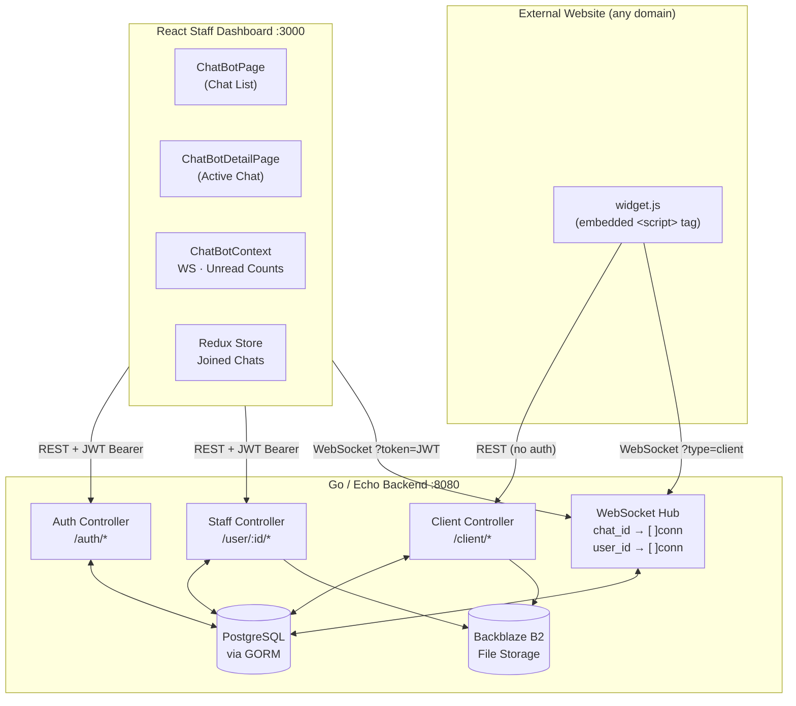
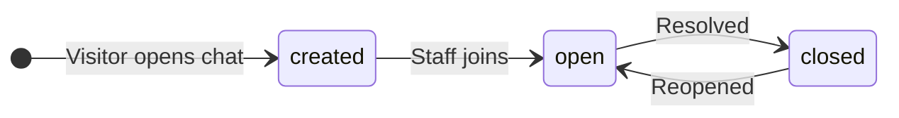
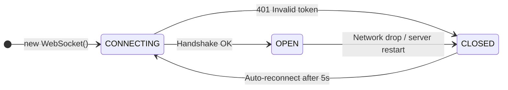
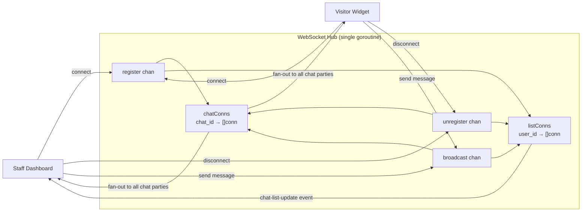
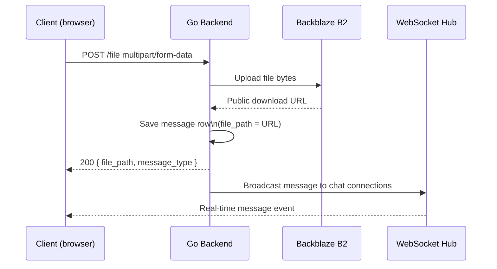
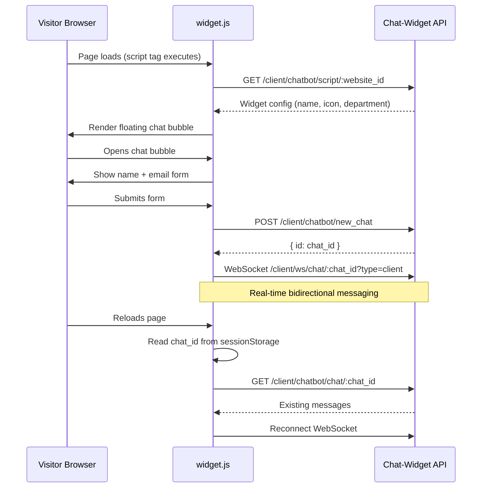
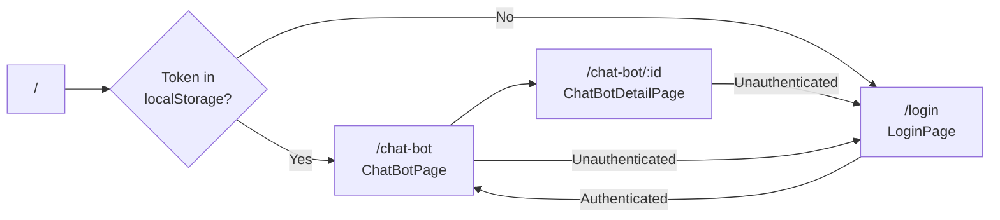

# Chat-Widget — Technical Documentation

## Table of Contents

1. [Project Overview](#1-project-overview)
2. [Architecture](#2-architecture)
3. [Environment Configuration](#3-environment-configuration)
4. [Database Schema](#4-database-schema)
5. [Running Migrations](#5-running-migrations)
6. [API Reference](#6-api-reference)
   - [Authentication](#61-authentication)
   - [Staff — Chat Management](#62-staff--chat-management)
   - [Staff — Website Management](#63-staff--website-management)
   - [Staff — Auto-Responses](#64-staff--auto-responses)
   - [Staff — Analytics](#65-staff--analytics)
   - [Client (Widget-facing)](#66-client-widget-facing)
   - [WebSocket Endpoints](#67-websocket-endpoints)
   - [Static Assets](#68-static-assets)
7. [WebSocket Protocol](#7-websocket-protocol)
8. [File Uploads](#8-file-uploads)
9. [Embeddable Widget](#9-embeddable-widget)
10. [Frontend Architecture](#10-frontend-architecture)
11. [Deployment Guide](#11-deployment-guide)
12. [Security Reference](#12-security-reference)
13. [Troubleshooting](#13-troubleshooting)

---

## 1. Project Overview

Chat-Widget is a self-hosted live chat platform. It consists of three components:

| Component | Location | Role |
|---|---|---|
| Backend | `Backend/` | Go/Echo REST API + WebSocket hub |
| Frontend | `Frontend/` | Staff dashboard (React + TypeScript) |
| Widget | `Widgets/widget.js` | Embeddable visitor-facing chat bubble |

**Technology versions:**

| Technology | Version |
|---|---|
| Go | 1.24 |
| Echo | v4 |
| GORM | v2 |
| gorilla/websocket | v1.5 |
| React | 18 |
| TypeScript | 5 |
| Vite | 8 |
| Tailwind CSS | v4 |
| PostgreSQL | 16 |

---

## 2. Architecture



### WebSocket fan-out pattern

The WebSocket hub (in `controllers/webSocket.go`) maintains two registries:

- **chat map** — `chatId → []Conn` — all parties in a specific chat (staff + client)
- **list map** — `userId → []Conn` — staff connections subscribed to the global chat-list notification stream

When a message is sent, the hub broadcasts to all connections in the `chatId` bucket. When any chat changes (new message, status update, new chat created), the hub also broadcasts a `chat-list-update` event to all connections in the `userId` bucket for the joined staff user, updating their sidebar in real time.

---

## 3. Environment Configuration

### Backend — `Backend/.env`

```env
# Database
DB_HOST=localhost
DB_PORT=5432
DB_USER=postgres
DB_PASSWORD=your_database_password
DB_NAME=chat_widget
SSL_MODE=disable

# Authentication
JWT_SECRET=replace_with_64_character_random_string_for_production

# Backblaze B2 File Storage
B2_KEY_ID=your_backblaze_application_key_id
B2_KEY=your_backblaze_application_key
B2_BUCKET_ID=your_bucket_id
B2_BUCKET_NAME=your-bucket-name

# Widget static file serving (path relative to Backend/)
WIDGETS_DIR=../Widgets

# Server
PORT=8080
```

**Required for file uploads:** A Backblaze B2 account with an Application Key that has read/write access to the specified bucket.

### Frontend — `Frontend/.env`

```env
VITE_API_URL=http://localhost:8080/api/v1
```

For production, set `VITE_API_URL` to your backend's public HTTPS URL **before** running `npm run build`. This value is baked into the frontend bundle at build time.

---

## 4. Database Schema

### `users`

Stores staff accounts.

```sql
CREATE TABLE users (
    id          SERIAL PRIMARY KEY,
    name        TEXT NOT NULL,
    email       TEXT NOT NULL UNIQUE,
    password    TEXT NOT NULL,       -- bcrypt hash
    profile_pic TEXT,
    created_at  TIMESTAMP WITH TIME ZONE DEFAULT now()
);
```

### `website_scripts`

One record per website the widget is deployed on.

```sql
CREATE TABLE website_scripts (
    id          UUID PRIMARY KEY DEFAULT gen_random_uuid(),
    user_id     INT NOT NULL REFERENCES users(id) ON DELETE CASCADE,
    name        TEXT NOT NULL,
    icon        TEXT,
    department  TEXT
);
```

The UUID `id` is what goes into the widget's `data-website-id` attribute.

### `chat_bot_chats`

One record per visitor conversation session.

```sql
CREATE TABLE chat_bot_chats (
    id          SERIAL PRIMARY KEY,
    script_id   UUID REFERENCES website_scripts(id) ON DELETE SET NULL,
    client_name TEXT,
    client_email TEXT,
    country     TEXT,
    device      TEXT,
    browser     TEXT,
    ip_address  TEXT,
    department  TEXT,
    status      TEXT NOT NULL DEFAULT 'created'
                CHECK (status IN ('created', 'open', 'closed')),
    jointed_by  INT REFERENCES users(id) ON DELETE SET NULL,
    preview     TEXT,
    attended    TEXT,
    created_at  TIMESTAMP WITH TIME ZONE DEFAULT now()
);
```

**Status lifecycle:**



- `created` — Chat initiated by visitor, no staff has joined yet
- `open` — A staff member has joined and replied
- `closed` — Conversation resolved

### `messages`

Individual messages within a chat.

```sql
CREATE TABLE messages (
    id           SERIAL PRIMARY KEY,
    chat_id      INT NOT NULL REFERENCES chat_bot_chats(id) ON DELETE CASCADE,
    user_id      INT REFERENCES users(id) ON DELETE SET NULL,
    messaged_as  INT REFERENCES users(id) ON DELETE SET NULL,  -- impersonation
    message      TEXT,
    message_type TEXT,       -- 'text', 'image', 'file', 'audio'
    messager     TEXT NOT NULL CHECK (messager IN ('client', 'staff')),
    file_path    TEXT,
    current_page TEXT,       -- URL visitor was on when message sent
    is_read      BOOLEAN NOT NULL DEFAULT false,
    created_at   TIMESTAMP WITH TIME ZONE DEFAULT now()
);
```

- `user_id` — actual staff user who sent the message (null for client messages)
- `messaged_as` — staff user being impersonated (for "reply as" feature)
- `messager` — discriminator: `'client'` or `'staff'`
- `current_page` — populated by the widget from the visitor's `window.location.href`

### `auto_responses`

Quick-reply templates, triggered by `/` in the staff chat input.

```sql
CREATE TABLE auto_responses (
    id         SERIAL PRIMARY KEY,
    user_id    INT NOT NULL REFERENCES users(id) ON DELETE CASCADE,
    message    TEXT NOT NULL,
    created_at TIMESTAMP WITH TIME ZONE DEFAULT now()
);
```

---

## 5. Running Migrations

The backend uses [sql-migrate](https://github.com/rubenv/sql-migrate). Migration files live in `Backend/migrations/`.

Migrations run automatically on backend startup via `config.InitDB()`. To run manually:

```bash
cd Backend
go install github.com/rubenv/sql-migrate/...@latest
sql-migrate up -config=dbconfig.yml
```

Or using the Go migration runner directly:

```bash
go run main.go   # InitDB() calls MigrateDB() which applies pending migrations
```

---

## 6. API Reference

**Base URL:** `http://localhost:8080/api/v1`

**Authentication:** All staff endpoints require `Authorization: Bearer <token>` header. WebSocket endpoints use `?token=<JWT>` query parameter instead (browsers cannot send headers during WebSocket upgrade).

**Standard response format:**

```json
{
  "success": true,
  "data": { ... }
}
```

Error response:
```json
{
  "success": false,
  "error": "Human-readable error message"
}
```

---

### 6.1 Authentication

#### `POST /auth/register`

Create a new staff account. No authentication required.

**Request body:**
```json
{
  "name": "Akhil Joshy",
  "email": "akhil@company.com",
  "password": "your_secure_password"
}
```

**Response `201`:**
```json
{
  "success": true,
  "data": {
    "id": 1,
    "name": "Akhil Joshy",
    "email": "akhil@company.com",
    "created_at": "2026-06-18T10:00:00Z"
  }
}
```

**Notes:** Disable or remove this endpoint after initial staff setup in production. Consider adding a setup-token guard.

---

#### `POST /auth/login`

Authenticate a staff user and receive a JWT token.

**Request body:**
```json
{
  "email": "akhil@company.com",
  "password": "your_secure_password"
}
```

**Response `200`:**
```json
{
  "success": true,
  "data": {
    "token": "eyJhbGciOiJIUzI1NiIsInR5cCI6IkpXVCJ9...",
    "user": {
      "id": 1,
      "name": "Akhil Joshy",
      "email": "akhil@company.com",
      "profile_pic": null
    }
  }
}
```

Token expiry: 24 hours (configurable in `controllers/auth.go`).

---

#### `GET /auth/me`

Return the profile of the currently authenticated staff user.

**Headers:** `Authorization: Bearer <token>`

**Response `200`:**
```json
{
  "success": true,
  "data": {
    "id": 1,
    "name": "Akhil Joshy",
    "email": "akhil@company.com",
    "profile_pic": "https://cdn.example.com/avatars/1.png"
  }
}
```

---

### 6.2 Staff — Chat Management

All endpoints below require `Authorization: Bearer <token>`.

`:user_id` is the authenticated user's numeric ID (from the `user.id` JWT claim).

---

#### `GET /user/:user_id/chat/list`

Paginated list of all chat sessions.

**Query parameters:**

| Param | Type | Default | Description |
|---|---|---|---|
| `page` | int | `1` | Page number |
| `limit` | int | `10` | Results per page |
| `search` | string | — | Filter by client name or email |
| `status` | string | — | `created`, `open`, or `closed` |
| `department` | string | — | Filter by department |

**Response `200`:**
```json
{
  "success": true,
  "data": {
    "chats": [
      {
        "id": 42,
        "client_name": "Jane Doe",
        "client_email": "jane@example.com",
        "status": "open",
        "department": "Support",
        "preview": "Hi, I need help with...",
        "jointed_by": 1,
        "unread_count": 3,
        "created_at": "2026-06-18T09:00:00Z"
      }
    ],
    "total": 150,
    "page": 1,
    "limit": 10
  }
}
```

---

#### `GET /user/:user_id/chat/:chat_id`

Full chat detail including messages (paginated).

**Query parameters:**

| Param | Type | Default | Description |
|---|---|---|---|
| `msg_page` | int | `1` | Message page (newest first) |
| `msg_limit` | int | `50` | Messages per page |

**Response `200`:**
```json
{
  "success": true,
  "data": {
    "chat": {
      "id": 42,
      "client_name": "Jane Doe",
      "client_email": "jane@example.com",
      "country": "IN",
      "device": "Desktop",
      "browser": "Chrome",
      "ip_address": "1.2.3.4",
      "department": "Support",
      "status": "open",
      "jointed_by": 1,
      "created_at": "2026-06-18T09:00:00Z"
    },
    "messages": [
      {
        "id": 101,
        "chat_id": 42,
        "user_id": null,
        "messaged_as": null,
        "message": "Hi, I need help with my account.",
        "message_type": "text",
        "messager": "client",
        "file_path": null,
        "current_page": "https://example.com/account",
        "is_read": false,
        "created_at": "2026-06-18T09:01:00Z"
      }
    ],
    "total_messages": 5,
    "staff": [
      { "id": 1, "name": "Akhil Joshy", "profile_pic": null }
    ]
  }
}
```

---

#### `PATCH /user/:user_id/chat/:chat_id/status`

Update the status of a chat session.

**Request body:**
```json
{ "status": "closed" }
```

Valid values: `created`, `open`, `closed`

**Response `200`:**
```json
{ "success": true, "data": { "status": "closed" } }
```

---

#### `PATCH /user/:user_id/chat/:chat_id/log`

Record a staff join or leave action.

**Request body:**
```json
{ "action": "join" }
```

Valid values: `join`, `leave`

Joining sets `jointed_by` to the current user and changes status to `open`. Leaving clears `jointed_by`.

---

#### `PATCH /user/:user_id/chat/:chat_id/read_status`

Mark all unread messages in a chat as read for the current staff user.

**Request body:** (empty or `{}`)

**Response `200`:**
```json
{ "success": true }
```

---

#### `POST /user/:user_id/chat/:chat_id/file`

Upload a file attachment to a chat (staff side).

**Content-Type:** `multipart/form-data`

**Form fields:**

| Field | Type | Description |
|---|---|---|
| `file` | File | The file to upload |
| `message_type` | string | `image`, `file`, or `audio` |

**Response `200`:**
```json
{
  "success": true,
  "data": {
    "file_path": "https://f005.backblazeb2.com/b2api/v1/b2_download_file_by_name/...",
    "message_type": "image"
  }
}
```

Files are uploaded to Backblaze B2. The returned `file_path` is a permanent public URL.

---

#### `GET /user/:user_id/staff`

List all staff users (used to populate the "reply as" impersonation dropdown).

**Response `200`:**
```json
{
  "success": true,
  "data": [
    { "id": 1, "name": "Akhil Joshy", "profile_pic": null },
    { "id": 2, "name": "Sarah Lee", "profile_pic": "https://..." }
  ]
}
```

---

### 6.3 Staff — Website Management

#### `POST /user/:user_id/chatbot`

Register a new website to embed the widget on.

**Request body:**
```json
{
  "name": "My Company Website",
  "icon": "https://example.com/favicon.png",
  "department": "Sales"
}
```

**Response `201`:**
```json
{
  "success": true,
  "data": {
    "id": "35a447a1-9c18-4d55-be9a-27feed8f8317",
    "name": "My Company Website",
    "user_id": 1
  }
}
```

The returned `id` (UUID) is your `data-website-id` for the embed snippet.

---

#### `GET /user/:user_id/chatbot/script`

List all registered websites for the current user.

**Response `200`:**
```json
{
  "success": true,
  "data": [
    {
      "id": "35a447a1-9c18-4d55-be9a-27feed8f8317",
      "name": "My Company Website",
      "icon": "https://example.com/favicon.png",
      "department": "Sales"
    }
  ]
}
```

---

#### `DELETE /user/:user_id/chatbot/script/:id`

Remove a website configuration.

**Response `200`:**
```json
{ "success": true }
```

---

### 6.4 Staff — Auto-Responses

Auto-responses are quick-reply templates. In the chat input, typing `/` shows a picker.

#### `GET /user/:user_id/chatbot/response`

List all auto-responses for the current user.

```json
{
  "success": true,
  "data": [
    { "id": 1, "message": "Thanks for reaching out! How can I help you today?" },
    { "id": 2, "message": "Let me look into that for you." }
  ]
}
```

#### `POST /user/:user_id/chatbot/response`

Create a new auto-response.

**Request body:**
```json
{ "message": "I'll escalate this to our technical team." }
```

#### `PATCH /user/:user_id/chatbot/response/:id`

Update an existing auto-response.

**Request body:**
```json
{ "message": "Updated response text." }
```

#### `DELETE /user/:user_id/chatbot/response/:id`

Delete an auto-response.

---

### 6.5 Staff — Analytics

#### `GET /user/:user_id/chat/overview`

Returns aggregate statistics.

**Response `200`:**
```json
{
  "success": true,
  "data": {
    "total": 250,
    "created": 12,
    "open": 38,
    "closed": 200,
    "today": 14
  }
}
```

---

### 6.6 Client (Widget-facing)

These endpoints are called by `widget.js` running on the visitor's browser. No authentication required.

---

#### `GET /client/chatbot/script/:website_id`

Fetch widget configuration for a given website ID.

**Response `200`:**
```json
{
  "success": true,
  "data": {
    "id": "35a447a1-9c18-4d55-be9a-27feed8f8317",
    "name": "My Company Website",
    "icon": "https://example.com/favicon.png",
    "department": "Sales"
  }
}
```

---

#### `POST /client/chatbot/new_chat`

Create a new visitor chat session.

**Request body:**
```json
{
  "script_id": "35a447a1-9c18-4d55-be9a-27feed8f8317",
  "client_name": "Jane Doe",
  "client_email": "jane@example.com",
  "department": "Sales",
  "country": "IN",
  "device": "Desktop",
  "browser": "Chrome",
  "ip_address": "1.2.3.4",
  "current_page": "https://example.com/pricing"
}
```

**Response `201`:**
```json
{
  "success": true,
  "data": {
    "id": 42,
    "status": "created"
  }
}
```

The returned `id` is the `chat_id` used for all subsequent WebSocket connections and message endpoints.

---

#### `GET /client/chatbot/chat/:chat_id`

Retrieve an existing chat session and its messages. The widget stores `chat_id` in `sessionStorage` and uses this to reconnect on page reload.

---

#### `PATCH /client/chatbot/chat/:chat_id/status`

Update chat status (e.g., visitor closes the widget → `closed`).

**Request body:**
```json
{ "status": "closed" }
```

---

#### `POST /client/chatbot/chat/:chat_id/file`

Upload a file attachment from the visitor side.

Same multipart format as the staff file upload endpoint.

---

### 6.7 WebSocket Endpoints

WebSockets require the JWT token as a query parameter because browsers cannot send `Authorization` headers during the HTTP → WebSocket upgrade.

#### `GET /user/:user_id/ws/chat/list?token=JWT`

**Purpose:** Staff global notification stream.

The server sends events whenever any chat changes (new message, status update, new visitor chat created). This drives the sidebar unread badge counts without polling.

**Server → Client message format:**
```json
{
  "type": "chat-list-update",
  "chat_id": 42,
  "title": "New message from Jane Doe",
  "data": { ... }
}
```

The client (ChatBotContext.tsx) maintains a reconnect-on-close loop with a 5-second delay.

---

#### `GET /user/:user_id/ws/chat/:chat_id?token=JWT`

**Purpose:** Staff real-time messaging in a specific chat.

Bidirectional. The staff dashboard sends and receives messages through this connection while viewing a chat.

**Client → Server (send a message):**
```json
{
  "message": "Hello! How can I help?",
  "message_type": "text",
  "messaged_as": null
}
```

**Server → Client (new message event):**
```json
{
  "id": 102,
  "chat_id": 42,
  "user_id": 1,
  "messaged_as": null,
  "message": "Hello! How can I help?",
  "message_type": "text",
  "messager": "staff",
  "file_path": null,
  "is_read": false,
  "created_at": "2026-06-18T09:05:00Z"
}
```

---

#### `GET /client/ws/chat/:chat_id?type=client`

**Purpose:** Visitor real-time messaging.

No JWT required. The `type=client` query parameter identifies the connection as a visitor (not staff). The server routes messages to all connections in the same `chat_id` bucket.

---

### 6.8 Static Assets

#### `GET /chat-widget/widget.js`

Serves the embeddable widget JavaScript file. The backend serves the `Widgets/` directory (configured via `WIDGETS_DIR` env var) at this path.

---

## 7. WebSocket Protocol

### Connection states



### Authentication flow

1. Frontend reads JWT from `localStorage.getItem('token')`
2. Appends `?token=<JWT>` to the WebSocket URL
3. `middleware/JWTMiddleware` intercepts, validates the token before the upgrade
4. On invalid/missing token: HTTP 401 (upgrade rejected, no WS connection established)
5. On valid token: user ID stored in Echo context, handler proceeds with upgrade

### Hub internals (`controllers/webSocket.go`)



All hub operations are serialized through channels — no mutex needed. The hub goroutine is started once at server boot and runs for the lifetime of the process.

---

## 8. File Uploads

Files are stored in Backblaze B2 via the B2 Native API (not S3-compatible).

**Upload flow:**



**Supported `message_type` values:**

| Value | Display behavior |
|---|---|
| `text` | Plain text message |
| `image` | Inline image preview |
| `file` | Downloadable file link |
| `audio` | Audio player (widget uses MediaRecorder API) |

**File naming:** `SanitizeFileName` in `config/utils.go` strips non-ASCII characters and spaces, then prepends a Unix timestamp for uniqueness.

---

## 9. Embeddable Widget

### Embed snippet

```html
<script
  src="https://your-server.com/api/v1/chat-widget/widget.js"
  data-website-id="35a447a1-9c18-4d55-be9a-27feed8f8317"
  data-base-url="https://your-server.com"
></script>
```

Place this just before `</body>` on any page.

### Widget behavior



### Customization

The widget reads branding (name, icon) from the website_scripts record. Update via the dashboard Settings panel or the API.

### Session persistence

The widget stores the following in `sessionStorage` (cleared when the browser tab closes):

- `chat_widget_chat_id` — current chat session ID
- `chat_widget_client_name` — visitor's entered name
- `chat_widget_client_email` — visitor's entered email

---

## 10. Frontend Architecture

### State management

| Layer | Technology | What it manages |
|---|---|---|
| Global WS notifications | `ChatBotContext` (React Context) | Unread counts, last-updated chat ID |
| Joined chats | Redux Toolkit slice | Whether the staff user has joined a chat (persists across navigation) |
| Server state | `useState` + fetch calls | Chat lists, message data, pagination |

### Route structure



`ProtectedRoute` reads `localStorage.getItem('token')`. If absent, redirects to `/login`.

### API service (`src/services/chatBotService.ts`)

All API calls go through an Axios instance that automatically injects `Authorization: Bearer <token>` from `localStorage`. The base URL is read from `import.meta.env.VITE_API_URL`.

### Tailwind CSS v4 note

Tailwind v4 uses `@import "tailwindcss"` and does **not** auto-map CSS custom properties (`--background`, `--primary`, etc.) used by shadcn/ui to utility classes. The `@theme inline` block in `src/index.css` performs this mapping:

```css
@theme inline {
  --color-background: hsl(var(--background));
  --color-primary: hsl(var(--primary));
  /* ... all shadcn/ui tokens */
}
```

Without this block, all shadcn/ui dialogs, cards, and selects render as transparent/invisible.

### Directory structure

```
Frontend/src/
├── components/
│   ├── AdminLayout.tsx      # Sidebar + topbar shell
│   ├── ProtectedRoute.tsx   # Auth guard
│   └── ui/                  # shadcn/ui components
├── contexts/
│   └── ChatBotContext.tsx   # Global WS + unread counts
├── pages/
│   ├── auth/
│   │   └── LoginPage.tsx
│   └── chat_bot/
│       ├── ChatBotPage.tsx       # Chat list
│       └── ChatBotDetailPage.tsx # Active conversation
├── services/
│   ├── EventServices.ts     # Axios instance + base URLs
│   └── chatBotService.ts    # Typed API call functions
├── store/
│   ├── index.ts
│   └── slices/
│       └── chatBotSlice.ts  # Joined chats Redux slice
├── App.tsx
├── main.tsx
└── index.css                # Tailwind v4 + shadcn theme tokens
```

---

## 11. Deployment Guide

### Backend binary

```bash
cd Backend
go build -o chat-widget-server .
./chat-widget-server
```

The binary reads `.env` from the working directory. Set all required env vars before starting.

### Frontend static build

```bash
cd Frontend
# Set production API URL first
echo "VITE_API_URL=https://chat.yourcompany.com/api/v1" > .env.production
npm run build
# Serve dist/ with any static file server
```

### Nginx configuration

```nginx
server {
    listen 443 ssl http2;
    server_name chat.yourcompany.com;

    ssl_certificate     /etc/ssl/certs/chat.crt;
    ssl_certificate_key /etc/ssl/private/chat.key;

    # API and WebSocket — proxy to Go backend
    location /api/ {
        proxy_pass         http://127.0.0.1:8080;
        proxy_http_version 1.1;
        proxy_set_header   Upgrade    $http_upgrade;
        proxy_set_header   Connection "upgrade";
        proxy_set_header   Host       $host;
        proxy_set_header   X-Real-IP  $remote_addr;
        proxy_read_timeout 3600s;   # Keep WS connections alive
    }

    # Frontend SPA
    location / {
        root       /var/www/chat-widget/Frontend/dist;
        try_files  $uri $uri/ /index.html;
    }
}

# HTTP → HTTPS redirect
server {
    listen 80;
    server_name chat.yourcompany.com;
    return 301 https://$host$request_uri;
}
```

The `proxy_read_timeout 3600s` is important — without it, Nginx will close idle WebSocket connections after 60 seconds.

### Process management (systemd)

```ini
# /etc/systemd/system/chat-widget.service
[Unit]
Description=Chat-Widget Backend
After=network.target postgresql.service

[Service]
Type=simple
User=www-data
WorkingDirectory=/opt/chat-widget/Backend
ExecStart=/opt/chat-widget/Backend/chat-widget-server
Restart=always
RestartSec=5
EnvironmentFile=/opt/chat-widget/Backend/.env

[Install]
WantedBy=multi-user.target
```

```bash
systemctl enable chat-widget
systemctl start chat-widget
systemctl status chat-widget
```

### Docker (optional)

```dockerfile
# Backend
FROM golang:1.24-alpine AS builder
WORKDIR /app
COPY Backend/ .
RUN go build -o chat-widget-server .

FROM alpine:latest
WORKDIR /app
COPY --from=builder /app/chat-widget-server .
COPY Widgets/ ../Widgets/
EXPOSE 8080
CMD ["./chat-widget-server"]
```

Set all env vars via `docker run -e KEY=VALUE` or a `.env` file with `--env-file`.

---

## 12. Security Reference

### Authentication

| Mechanism | Details |
|---|---|
| Password hashing | bcrypt, cost factor 10 |
| Token format | JWT HS256 |
| Token expiry | 24 hours |
| Token storage (frontend) | `localStorage` (trade-off: XSS vs CSRF) |
| WebSocket auth | `?token=JWT` query param — validated by `JWTMiddleware` before upgrade |

### Hardening for production

- **JWT_SECRET**: Must be at least 32 random bytes. Generate with: `openssl rand -hex 32`
- **Register endpoint**: Remove or add a one-time setup token after creating initial staff accounts
- **HTTPS only**: Both HTTP REST and WebSocket connections should use TLS in production. `wss://` requires HTTPS on the page origin
- **PostgreSQL**: Use a dedicated user with `GRANT` restricted to only the `chat_widget` database. Do not use `postgres` superuser
- **Backblaze B2**: Create an Application Key scoped to a single bucket with minimum required capabilities (`listBuckets`, `listFiles`, `readFiles`, `writeFiles`)
- **CORS**: Currently set to `AllowOrigins: ["*"]` — required for the widget to embed on external sites. Do not restrict this unless you control all embed domains

### What is NOT stored

- Visitor passwords (visitors don't authenticate)
- Payment or financial data
- Raw file contents — files go directly to B2, only the URL is stored in PostgreSQL

---

## 13. Troubleshooting

### WebSocket connections fail with 401

**Cause:** JWT token missing or expired.
**Fix:** Ensure the token is stored in `localStorage` under the key `token`, and the value is a valid non-expired JWT. If the frontend is working but WS fails, the token may have expired — log out and log back in.

### All dialogs and modals appear transparent

**Cause:** Tailwind CSS v4 does not auto-map shadcn/ui CSS variables without `@theme inline`.
**Fix:** Ensure `Frontend/src/index.css` contains the `@theme inline { ... }` block with all `--color-*` and `--radius-*` mappings.

### File uploads return 500

**Cause:** Backblaze B2 credentials missing or incorrect.
**Fix:** Verify `B2_KEY_ID`, `B2_KEY`, `B2_BUCKET_ID`, and `B2_BUCKET_NAME` in `Backend/.env`. Test credentials with the B2 CLI: `b2 authorize-account <keyId> <applicationKey>`.

### Backend panics on startup

**Cause:** Database connection failed.
**Fix:** Check `DB_HOST`, `DB_PORT`, `DB_USER`, `DB_PASSWORD`, `DB_NAME` in `.env`. Ensure PostgreSQL is running and the database exists: `createdb chat_widget`.

### Widget does not appear on embedded page

**Cause:** `data-website-id` is invalid or `data-base-url` points to wrong server.
**Fix:** Open browser devtools → Network → look for the `GET /client/chatbot/script/:id` request. If it 404s, the website ID is wrong. If it fails with CORS error, the backend CORS config is misconfigured.

### Nginx closes WebSocket after 60 seconds

**Cause:** Default `proxy_read_timeout` is 60s.
**Fix:** Add `proxy_read_timeout 3600s;` to the `/api/` location block (see Deployment Guide above).

### `go: module path changed`

**Cause:** After renaming from `chatbot` to `chat-widget` in `go.mod`, stale build cache.
**Fix:**
```bash
cd Backend
go clean -cache
go mod tidy
go build .
```
