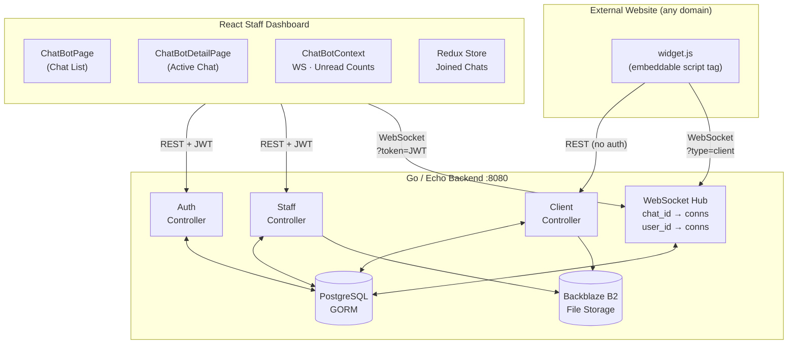
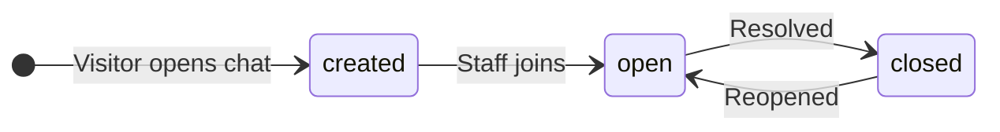

<div align="center">

# Chat-Widget

**A production-ready, embeddable live chat platform built for the modern web.**

[](https://go.dev/)
[](https://react.dev/)
[](https://www.typescriptlang.org/)
[](https://www.postgresql.org/)
[](https://developer.mozilla.org/en-US/docs/Web/API/WebSocket)
[](LICENSE)

[Features](#features) · [Architecture](#architecture) · [Quick Start](#quick-start) · [API Docs](#api-documentation) · [Widget Embed](#embedding-the-widget)

</div>

---

## What is Chat-Widget?

Chat-Widget is a **self-hosted, embeddable live chat system** — drop one `<script>` tag onto any webpage and your staff can handle conversations in real time from a clean, modern dashboard.

No third-party SaaS dependencies. No per-seat pricing. Full data ownership.

```html
<!-- Add this to any website -->
<script
  src="https://your-server.com/api/v1/chat-widget/widget.js"
  data-id="your-website-id"
  data-base-url="https://your-server.com"
></script>
```

---

## Features

### For Visitors
- **Instant chat** — no login, no account required
- **Real-time messaging** over WebSocket
- **File & image sharing** — drag, drop, or paste
- **Audio messages** — record and send voice notes in-browser
- **Department routing** — connect to the right team instantly

### For Staff
- **Unified inbox** — all conversations across all websites in one place
- **Live notifications** — unread badge counts update in real time via WebSocket
- **Chat history** — view a visitor's previous sessions side-by-side with the current one
- **Whisper mode** — internal staff notes invisible to the visitor
- **Impersonation** — reply as any team member
- **Auto-responses** — define `/` slash-triggered quick replies
- **Multi-website support** — manage multiple domains from one dashboard
- **Analytics overview** — total chats, open/closed counts, avg response time

### Platform
- **WebSocket hub** — efficient broadcast fan-out, zero polling
- **Backblaze B2** file storage — scalable, affordable object storage
- **JWT authentication** — stateless, 24-hour token-based staff auth
- **SQL migrations** — versioned schema via sql-migrate
- **CORS-open API** — widget embeds on any external domain

---

## Architecture



### Technology Stack

| Layer | Technology | Why |
|---|---|---|
| Backend language | Go 1.24 | Performance, concurrency, small binary |
| Web framework | Echo v4 | Fast, minimal, middleware-friendly |
| ORM | GORM | Type-safe DB access with PostgreSQL |
| Real-time | gorilla/websocket | Battle-tested WebSocket implementation |
| Auth | JWT (golang-jwt/jwt v5) + bcrypt | Stateless, secure, industry standard |
| File storage | Backblaze B2 | S3-compatible, 10x cheaper than AWS S3 |
| Migrations | sql-migrate | Versioned, rollback-safe schema changes |
| Frontend | React 18 + TypeScript + Vite 8 | Fast builds, type safety, modern DX |
| Styling | Tailwind CSS v4 | Utility-first, zero runtime |
| Components | shadcn/ui (Radix UI) | Accessible, composable, unstyled primitives |
| State | Redux Toolkit + React Context | Persistent join state + global WS notifications |
| HTTP client | Axios | Interceptors for auto Bearer token injection |

---

## Quick Start

### Prerequisites
- Go 1.24+
- Node.js 20+
- PostgreSQL 16+
- A [Backblaze B2](https://www.backblaze.com/b2/cloud-storage.html) bucket (free tier: 10GB)

### 1. Clone the repository

```bash
git clone https://github.com/your-username/chat-widget.git
cd chat-widget
```

### 2. Configure the backend

Edit `Backend/.env`:

```env
DB_HOST=localhost
DB_PORT=5432
DB_USER=your_db_user
DB_PASSWORD=your_db_password
DB_NAME=chat_widget
SSL_MODE=disable

JWT_SECRET=replace_with_64_char_random_secret

B2_KEY_ID=your_backblaze_key_id
B2_KEY=your_backblaze_app_key
B2_BUCKET_ID=your_bucket_id
B2_BUCKET_NAME=your-bucket-name

WIDGETS_DIR=../Widgets
PORT=8080
```

### 3. Run the backend

```bash
cd Backend
go run main.go
# Chat-Widget server running on :8080
```

Migrations run automatically on first start.

### 4. Create your first staff account

```bash
curl -X POST http://localhost:8080/api/v1/auth/register \
  -H "Content-Type: application/json" \
  -d '{"name":"Your Name","email":"you@company.com","password":"yourpassword"}'
```

### 5. Run the frontend dashboard

```bash
cd Frontend
npm install
npm run dev
# Open http://localhost:3000
```

### 6. Register a website and embed the widget

1. Log in to the dashboard at `http://localhost:3000`
2. Click **Settings → Websites → Add**
3. Copy the generated `website-id`
4. Paste this snippet into any webpage:

```html
<script
  src="http://localhost:8080/api/v1/chat-widget/widget.js"
  data-id="YOUR_WEBSITE_ID"
  data-base-url="http://localhost:8080"
></script>
```

---

## Embedding the Widget

The widget is a single self-contained JavaScript file. No npm, no build step required on your target website.

```html
<script
  src="https://chat.yourcompany.com/api/v1/chat-widget/widget.js"
  data-id="35a447a1-9c18-4d55-be9a-27feed8f8317"
  data-base-url="https://chat.yourcompany.com"
></script>
```

| Attribute | Required | Description |
|---|---|---|
| `data-id` | Yes | UUID from the dashboard Websites panel |
| `data-base-url` | Yes | Base URL of your Chat-Widget backend |

### Where to paste the snippet

Paste the script tag **just before the closing `</body>` tag** of your HTML file. This applies to any website type:

**Plain HTML website:**
```html
    ...your page content...

    <script
      src="https://chat.yourcompany.com/api/v1/chat-widget/widget.js"
      data-id="YOUR_WEBSITE_ID"
      data-base-url="https://chat.yourcompany.com"
    ></script>
  </body>
</html>
```

**WordPress:** Appearance → Theme Editor → `footer.php` → paste just before `</body>`

**Shopify:** Online Store → Themes → Edit Code → `theme.liquid` → paste just before `</body>`

**Webflow:** Project Settings → Custom Code → Footer Code → paste there

**Wix:** Settings → Custom Code → Add Code → place in Body (end)

**Squarespace:** Settings → Advanced → Code Injection → Footer → paste there

> The widget appears as a floating chat bubble in the bottom-right corner of your website as soon as the snippet is added.

---

## API Documentation

See the full reference: [DOCUMENTATION.md](DOCUMENTATION.md)

**Base URL:** `http://localhost:8080/api/v1`

### Auth endpoints

| Method | Endpoint | Auth | Description |
|---|---|---|---|
| POST | `/auth/register` | None | Create staff account |
| POST | `/auth/login` | None | Login → returns JWT token |
| GET | `/auth/me` | JWT | Get current user profile |

### Staff endpoints (JWT required)

| Method | Endpoint | Description |
|---|---|---|
| GET | `/user/:id/chat/list` | Paginated chat list with search/filter |
| GET | `/user/:id/chat/:chat_id` | Chat detail + paginated messages |
| PATCH | `/user/:id/chat/:chat_id/status` | Update chat status |
| PATCH | `/user/:id/chat/:chat_id/log` | Log join/leave action |
| PATCH | `/user/:id/chat/:chat_id/read_status` | Mark messages as read |
| POST | `/user/:id/chat/:chat_id/file` | Upload file to chat |
| GET | `/user/:id/chat/overview` | Analytics overview |
| POST | `/user/:id/chatbot` | Register new website |
| GET | `/user/:id/chatbot/script` | List registered websites |
| DELETE | `/user/:id/chatbot/script/:id` | Remove website |
| GET | `/user/:id/chatbot/response` | List auto-responses |
| POST | `/user/:id/chatbot/response` | Create auto-response |
| PATCH | `/user/:id/chatbot/response/:id` | Update auto-response |
| DELETE | `/user/:id/chatbot/response/:id` | Delete auto-response |
| GET | `/user/:id/staff` | List all staff users |
| WS | `/user/:id/ws/chat/list?token=JWT` | Real-time chat list updates |
| WS | `/user/:id/ws/chat/:chat_id?token=JWT` | Real-time messaging |

### Client endpoints (widget → API, no auth)

| Method | Endpoint | Description |
|---|---|---|
| GET | `/client/chatbot/script/:website_id` | Fetch widget config |
| POST | `/client/chatbot/new_chat` | Start new visitor chat |
| GET | `/client/chatbot/chat/:chat_id` | Get chat + messages |
| PATCH | `/client/chatbot/chat/:chat_id/status` | Update status |
| POST | `/client/chatbot/chat/:chat_id/file` | Upload file |
| WS | `/client/ws/chat/:chat_id?type=client` | Real-time visitor messaging |

### Widget static asset

| Method | Endpoint | Description |
|---|---|---|
| GET | `/chat-widget/widget.js` | Serve the embeddable widget JS |

---

## Database Schema

```sql
users (
  id            SERIAL PRIMARY KEY,
  name          TEXT NOT NULL,
  email         TEXT UNIQUE NOT NULL,
  password      TEXT NOT NULL,       -- bcrypt hash
  profile_pic   TEXT,
  created_at    TIMESTAMP
)

website_scripts (
  id            UUID PRIMARY KEY DEFAULT gen_random_uuid(),
  user_id       INT REFERENCES users(id),
  name          TEXT NOT NULL,
  icon          TEXT,
  department    TEXT
)

chat_bot_chats (
  id            SERIAL PRIMARY KEY,
  script_id     UUID REFERENCES website_scripts(id),
  client_name   TEXT,
  client_email  TEXT,
  country       TEXT,
  device        TEXT,
  browser       TEXT,
  ip_address    TEXT,
  department    TEXT,
  status        TEXT CHECK (status IN ('created','open','closed')),
  jointed_by    INT REFERENCES users(id),
  preview       TEXT,
  attended      TEXT,
  created_at    TIMESTAMP
)

messages (
  id            SERIAL PRIMARY KEY,
  chat_id       INT REFERENCES chat_bot_chats(id),
  user_id       INT REFERENCES users(id),
  messaged_as   INT REFERENCES users(id),
  message       TEXT,
  message_type  TEXT,
  messager      TEXT CHECK (messager IN ('client','staff')),
  file_path     TEXT,
  current_page  TEXT,
  is_read       BOOLEAN DEFAULT false,
  created_at    TIMESTAMP
)

auto_responses (
  id            SERIAL PRIMARY KEY,
  user_id       INT REFERENCES users(id),
  message       TEXT NOT NULL,
  created_at    TIMESTAMP
)
```

**Chat status lifecycle:**



---

## Production Deployment

### Build & serve

```bash
# Backend binary
cd Backend
go build -o chat-widget-server .
./chat-widget-server

# Frontend static build
cd Frontend
npm run build
# Serve dist/ with nginx / Caddy / any static host
```

### Nginx reverse proxy

```nginx
server {
    listen 443 ssl;
    server_name chat.yourcompany.com;

    # Backend API + WebSocket upgrade
    location /api/ {
        proxy_pass http://127.0.0.1:8080;
        proxy_http_version 1.1;
        proxy_set_header Upgrade $http_upgrade;
        proxy_set_header Connection "upgrade";
        proxy_set_header Host $host;
        proxy_set_header X-Real-IP $remote_addr;
    }

    # Frontend dashboard
    location / {
        root /var/www/chat-widget/Frontend/dist;
        try_files $uri $uri/ /index.html;
    }
}
```

### Security checklist for production

- [ ] Set `JWT_SECRET` to a 64-character random string
- [ ] Use a dedicated PostgreSQL user with restricted privileges
- [ ] Configure Backblaze B2 credentials with Application Key (not master key)
- [ ] Remove or guard the `/auth/register` endpoint after initial setup
- [ ] Enable HTTPS — WebSocket (`wss://`) requires it
- [ ] Set `SSL_MODE=require` in `.env` if PostgreSQL is on a separate host

---

## Security Model

| Concern | Approach |
|---|---|
| Password storage | bcrypt (cost 10) |
| Staff sessions | JWT, 24h expiry, HS256 |
| WebSocket auth | `?token=JWT` query param (browsers can't send WS headers) |
| File storage | Backblaze B2 — files never touch the server disk |
| API access control | JWT middleware on all staff routes |
| CORS | Open (`*`) — required for widget embed on external sites |
| Client privacy | No PII stored beyond name/email provided voluntarily |

---

## License

MIT © 2026 Akhil Joshy

---

<div align="center">
Self-hosted · Zero vendor lock-in · Built with Go + React + WebSockets
</div>
